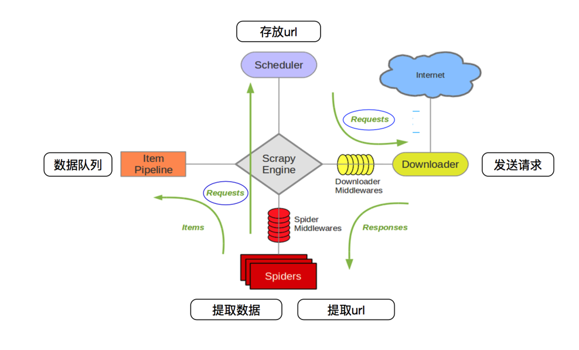

模仿scrapy的数据流



大致模块:
1. downloader: 每个下载任务被封装成一个downloader对象,提交给线程池下载(用HttpClient作为网络库)
2. scheduler: 内容含有2个队列,Request队列和Response队列,通过生产消费者,去重暂定使用一个简单的Set来过滤url字符串
3. pipeline: 在spider调用parse后解析出Item后,会被该spider上所有pipeline处理
4. Engine: 在这里完成数据流的调度  Request队列-> Downloader下载 -> Response队列 -> Spider中parse解析 -> PipeLine
5. Request: 封装对应的url和回调函数
6. Response: 封装InputStream和css,xpath解析

<br>
注意:<br>  
1. idea需要安装lombok插件<br>
2. 本项目是用于学习的小轮子
<br>
<br>
简单的二级页面爬取示例()

```java
package simples;

import engine.SpiderApp;
import lombok.extern.slf4j.Slf4j;
import response.Response;
import response.Result;
import spider.Spider;

import java.util.List;
import java.util.stream.Collectors;

@Slf4j
public class TestSpider extends Spider {


    public TestSpider(String name) {
        super(name);
    }

    @Override
    public void onStart() {
        this.addPipeLines((item, request) -> System.out.println(item));
        setStartUrls("https://fuliba2020.net/");
    }

    @Override
    public Result parse(Response response) {
        Result result = new Result();

        //获取详情页url,传入回调函数
        List<String> items = response.getBody().css("body > section > div.content-wrap > div > article.excerpt > header > h2 > a").stream().map(element -> element.attr("href")).collect(Collectors.toList());
        for (String detailUrl : items) {
            result.addRequest(detailUrl, this::parseDetail);
        }

        //获取下一页的列表(不传入parse的话,默认使用parse解析)
        List<String> nextPage = response.getBody().css("body > section > div.content-wrap > div > div.pagination > ul > li > a ").stream().map(element -> element.attr("href")).collect(Collectors.toList());
        result.setUrls(nextPage);
        return result;
    }

    public Result parseDetail(Response response) {
        String url = response.getBody().css("body > section > div.content-wrap > div > header > h1 > a").get(0).text();
        String context = response.getBody().css("body > section > div.content-wrap > div > article").get(0).html();

        PageItem pageItem = new PageItem(url, context);
        Result result = new Result(pageItem);
        return result;
    }

    public static void main(String[] args) throws InterruptedException {
        //启动
        TestSpider testSpider = new TestSpider("test-spider");
        new SpiderApp(testSpider).start();
    }
}

```

